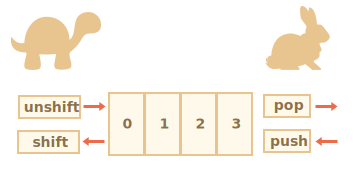

# Arrays

Imagine you need to store a list of things: a shopping list, a list of student names, or a collection of favorite songs. You could create separate variables like this:

```js
let fruit1 = "Apple";
let fruit2 = "Orange";
let fruit3 = "Plum";
```

But this gets messy fast! What if you have 100 fruits? Or what if you don't know how many items you'll have?

That's where **Arrays** come in! Arrays let you store multiple values in a single variable, keeping them organized in order.

## Creating an Array

There are two ways to create an empty array:

```js
let arr = new Array();
let arr = [];
```

Almost everyone uses the second way because it's shorter and cleaner. You can also add items right away:

```js
let fruits = ["Apple", "Orange", "Plum"];
```

Arrays use numbers to access items, starting from zero (not one!).

```js run
let fruits = ["Apple", "Orange", "Plum"];

alert( fruits[0] ); // Apple
alert( fruits[1] ); // Orange
alert( fruits[2] ); // Plum
```

You can change an item:

```js
fruits[2] = 'Pear'; // now ["Apple", "Orange", "Pear"]
```

Or add a new one:

```js
fruits[3] = 'Lemon'; // now ["Apple", "Orange", "Pear", "Lemon"]
```

Want to know how many items are in the array? Use `length`:

```js run
let fruits = ["Apple", "Orange", "Plum"];

alert( fruits.length ); // 3
```

You can even show the whole array at once:

```js run
let fruits = ["Apple", "Orange", "Plum"];

alert( fruits ); // Apple,Orange,Plum
```

Arrays can hold anything: numbers, text, objects, functions, even other arrays!

```js run no-beautify
// mix of different types
let arr = [ 'Apple', { name: 'John' }, true, function() { alert('hello'); } ];

// get the object at position 1 and show its name
alert( arr[1].name ); // John

// get the function at position 3 and run it
arr[3](); // hello
```

````smart header="Trailing comma"
You can put a comma after the last item:
```js
let fruits = [
  "Apple",
  "Orange",
  "Plum"*!*,*/!*
];
```

This makes it easier to add or remove items later because all lines look the same.
````

## Adding and Removing Items

Arrays have built-in methods to add or remove items from the beginning or end.

### Working with the end of the array

**pop** takes the last item out and gives it to you:

```js run
let fruits = ["Apple", "Orange", "Pear"];

alert( fruits.pop() ); // removes "Pear" and shows it

alert( fruits ); // Apple, Orange
```

**push** adds items to the end:

```js run
let fruits = ["Apple", "Orange"];

fruits.push("Pear");

alert( fruits ); // Apple, Orange, Pear
```

By the way, `fruits.push(...)` is the same as writing `fruits[fruits.length] = ...`.

### Working with the beginning of the array

**shift** takes the first item out:

```js run
let fruits = ["Apple", "Orange", "Pear"];

alert( fruits.shift() ); // removes Apple and shows it

alert( fruits ); // Orange, Pear
```

**unshift** adds items to the beginning:

```js run
let fruits = ["Orange", "Pear"];

fruits.unshift('Apple');

alert( fruits ); // Apple, Orange, Pear
```

Both `push` and `unshift` can add multiple items at once:

```js run
let fruits = ["Apple"];

fruits.push("Orange", "Peach");
fruits.unshift("Pineapple", "Lemon");

// ["Pineapple", "Lemon", "Apple", "Orange", "Peach"]
alert( fruits );
```

## How Arrays Really Work

Here's a secret: arrays are actually special objects! When you write `arr[0]`, you're using object syntax. The number 0 is like a property name.

Arrays are objects with special superpowers. They have methods to work with ordered data and a `length` property that tracks the size.

Because arrays are objects, they behave like objects. For example, they're copied by reference:

```js run
let fruits = ["Banana"]

let arr = fruits; // both variables point to the same array

alert( arr === fruits ); // true

arr.push("Pear"); // change the array using one variable

alert( fruits ); // Banana, Pear - the other variable sees the change too!
```

JavaScript engines optimize arrays to be super fast. They store array items in continuous memory, one after another. But these optimizations only work if you use arrays the right way!

Don't do weird things like this:

```js
let fruits = []; // make an array

fruits[99999] = 5; // skip to index 99999

fruits.age = 25; // add random properties
```

This breaks the optimization! Arrays work best when you:
1. Use them for ordered data with regular numbers (0, 1, 2, 3...)
2. Don't skip numbers or create big gaps
3. Don't add non-numeric properties

Stick to these rules and arrays will be blazing fast!

## Speed Matters

**push and pop are fast. shift and unshift are slow.**



Why? When you use `shift`, JavaScript has to:

```js
fruits.shift(); // take 1 element from the start
```

1. Remove the item at position 0
2. Move everything left (item 1 becomes item 0, item 2 becomes item 1, etc.)
3. Update the length


The more items in the array, the more work JavaScript has to do! Same problem with `unshift`.

But `pop` is easy:

```js
fruits.pop(); // take 1 element from the end
```


Just remove the last item and update the length. No moving needed! That's why it's super fast. Same with `push`.

## Looping Through Arrays

The old way uses a regular `for` loop:

```js run
let arr = ["Apple", "Orange", "Pear"];

*!*
for (let i = 0; i < arr.length; i++) {
*/!*
  alert( arr[i] );
}
```

But there's a better way called `for..of`:

```js run
let fruits = ["Apple", "Orange", "Plum"];

// goes through each item
for (let fruit of fruits) {
  alert( fruit );
}
```

The `for..of` loop gives you the value directly. You don't need to write `arr[i]`. Much cleaner!

There's also `for..in`, but **don't use it for arrays**:

```js run
let arr = ["Apple", "Orange", "Pear"];

*!*
for (let key in arr) {
*/!*
  alert( arr[key] ); // Apple, Orange, Pear
}
```

Why not? Two problems:

1. `for..in` loops through ALL properties, not just the numeric ones. This can cause weird bugs.
2. `for..in` is 10 to 100 times slower for arrays because it's made for objects, not arrays.

Bottom line: Use `for..of` for arrays. Save `for..in` for objects.

## The Magic of Length

The `length` property updates automatically. But it doesn't count items! It's actually the highest index plus one.

Watch this:

```js run
let fruits = [];
fruits[123] = "Apple";

alert( fruits.length ); // 124
```

Only one item, but length is 124! That's because the highest index is 123, so length becomes 124.

Here's something cool: `length` is writable. You can change it!

```js run
let arr = [1, 2, 3, 4, 5];

arr.length = 2; // cut it down to 2 items
alert( arr ); // [1, 2]

arr.length = 5; // try to restore it
alert( arr[3] ); // undefined: the values are gone forever!
```

Once you shrink it, the data is lost. It doesn't come back!

Want to clear an array? Easiest way: `arr.length = 0;`

## The new Array() Syntax

There's another way to create arrays:

```js
let arr = *!*new Array*/!*("Apple", "Pear", "etc");
```

Nobody uses this because `[]` is shorter. Plus, it has a weird trap!

If you pass a single number, it creates an empty array with that length:

```js run
let arr = new Array(2); // creates array with 2 empty spots

alert( arr[0] ); // undefined! no items

alert( arr.length ); // length is 2
```

Confusing, right? Just use `[]` brackets instead.

## Arrays Inside Arrays

Arrays can contain other arrays! This is called a multidimensional array. Great for storing grids or tables:

```js run
let matrix = [
  [1, 2, 3],
  [4, 5, 6],
  [7, 8, 9]
];

alert( matrix[1][1] ); // 5, the middle element
```

The first `[1]` gets the second row. The second `[1]` gets the second item in that row.

## Converting Arrays to Text

Arrays have a `toString` method that joins items with commas:

```js run
let arr = [1, 2, 3];

alert( arr ); // 1,2,3
alert( String(arr) === '1,2,3' ); // true
```

Watch what happens with the + operator:

```js run
alert( [] + 1 ); // "1"
alert( [1] + 1 ); // "11"
alert( [1,2] + 1 ); // "1,21"
```

The array converts to a string first, then the addition happens:

```js run
alert( "" + 1 ); // "1"
alert( "1" + 1 ); // "11"
alert( "1,2" + 1 ); // "1,21"
```

## Never Compare Arrays with ==

Don't use `==` to compare arrays! It doesn't work the way you'd expect.

```js run
alert( [] == [] ); // false
alert( [0] == [0] ); // false
```

Even identical arrays aren't equal because they're different objects in memory. JavaScript doesn't compare the contents.

Even weirder results happen with primitives:

```js run
alert( 0 == [] ); // true

alert('0' == [] ); // false
```

Why? The array converts to an empty string `''`, then that converts to the number 0. Type conversion chaos!

How do you compare arrays then? Loop through them and compare item by item. We'll learn better methods in the next chapter.

## Quick Recap

Arrays are special objects for storing ordered lists.

**Creating arrays:**
```js
// square brackets (use this one)
let arr = [item1, item2...];

// new Array (rarely used)
let arr = new Array(item1, item2...);
```

The `length` property tells you the size. If you manually shrink `length`, the array gets cut.

**Adding and removing items:**
* `push(...items)` adds items to the end
* `pop()` removes the last item and returns it
* `shift()` removes the first item and returns it
* `unshift(...items)` adds items to the beginning

**Looping:**
* `for (let i=0; i<arr.length; i++)` the classic way, fastest
* `for (let item of arr)` the modern way, cleanest
* `for (let i in arr)` never use this for arrays!

**Remember:** Don't use `==` to compare arrays. Use a loop to compare items one by one instead.

Next up, we'll learn more powerful array methods for searching, sorting, and transforming arrays!
