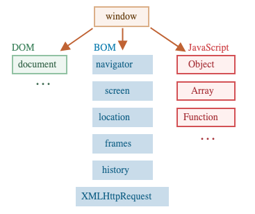

# Environment on which JS Runs

JavaScript was originally created for web browsers. Today, it runs in many different places—browsers, servers, and even smart devices.

Each place where JavaScript runs is called a **host environment**. A host environment could be:
- A web browser
- A web server (like Node.js)
- Any device that can run JavaScript

Each host environment provides its own special objects and functions beyond the core JavaScript language. For example, browsers give you tools to control web pages, while Node.js gives you server-side tools.

Here's what JavaScript looks like when it runs in a web browser:



## The `window` Object

The `window` object is the main object in the browser. It does two important things:

1. **It's the global object** - All global variables and functions you create become properties of `window`
2. **It represents the browser window** - It gives you information and control over the browser window itself

Here's an example of using `window` as the global object:

```js run global
function sayHi() {
  alert("Hello");
}

// Global functions are accessible through window
window.sayHi();
```

And here's how you can use it to get information about the browser window:

```js run
alert(window.innerHeight); // Shows the inner height of the window
```

There are many more `window` properties and methods we'll explore later.

## DOM (Document Object Model)

The **Document Object Model** (DOM) is how JavaScript sees and interacts with everything on a web page. Think of it as a way to turn all the HTML elements into objects that you can read and modify with JavaScript.

The `document` object is your main way to access the page. You can use it to change anything on the page or create new elements.

For example:

```js run
// Change the background color to red
document.body.style.background = "red";

// Change it back after 1 second
setTimeout(() => document.body.style.background = "", 1000);
```

This example uses `document.body.style`, but there's much more you can do. All the available properties and methods are documented in the [DOM Living Standard](https://dom.spec.whatwg.org).

```smart header="DOM is not only for browsers"
The DOM isn't just for browsers. The DOM specification describes how documents are structured and how to manipulate them. Other tools can use it too.

For example, server-side scripts that download and process HTML pages can also use the DOM, though they might only support part of the specification.
```

```smart header="CSSOM for styling"
There's also a separate specification called [CSS Object Model (CSSOM)](https://www.w3.org/TR/cssom-1/) that explains how CSS rules and stylesheets work as objects, and how to read and write them.

CSSOM works together with the DOM when you modify styles. In practice, you rarely need CSSOM directly because you usually just add or remove CSS classes rather than modifying CSS rules themselves. But it's available if you need it.
```

## BOM (Browser Object Model)

The **Browser Object Model** (BOM) provides objects for working with browser features that aren't part of the document itself.

For example:

- The `navigator` object tells you about the browser and operating system. Two commonly used properties are:
  - `navigator.userAgent` - Information about the current browser
  - `navigator.platform` - Information about the operating system (Windows, Linux, Mac, etc.)
- The `location` object lets you read the current URL and redirect the browser to a new page

Here's how to use the `location` object:

```js run
alert(location.href); // Shows the current URL
if (confirm("Go to Wikipedia?")) {
  location.href = "https://wikipedia.org"; // Redirects to another URL
}
```

Functions like `alert`, `confirm`, and `prompt` are also part of the BOM. They're browser features for communicating with the user, not directly related to the document.

```smart header="Specifications"
The BOM is part of the [HTML specification](https://html.spec.whatwg.org).

You might be surprised, but the HTML spec isn't just about HTML tags and attributes. It also covers browser objects, methods, and browser-specific DOM extensions. Some additional specifications are listed at <https://spec.whatwg.org>.
```

## Summary

Here are the main specifications you should know about:

**DOM specification**
: Describes the document structure, how to manipulate it, and events. See <https://dom.spec.whatwg.org>.

**CSSOM specification**
: Describes stylesheets and style rules, how to manipulate them, and how they connect to documents. See <https://www.w3.org/TR/cssom-1/>.

**HTML specification**
: Describes the HTML language (tags, attributes) and also the BOM—browser functions like `setTimeout`, `alert`, `location`, and more. See <https://html.spec.whatwg.org>. It builds on the DOM specification and adds many additional properties and methods.

Some additional classes are described separately at <https://spec.whatwg.org/>.

**Important**: There's too much to learn and remember everything. When you need to look something up:

- The [Mozilla Developer Network (MDN)](https://developer.mozilla.org/en-US/) is a great resource with clear explanations
- The official specifications are more detailed and complete, but can be harder to read

To find information quickly, try searching:
- "WHATWG [term]" - for official specifications
- "MDN [term]" - for Mozilla's documentation

For example: <https://google.com?q=whatwg+localstorage> or <https://google.com?q=mdn+localstorage>

Now let's dive into learning the DOM, since the document is central to everything you'll do with web pages.
